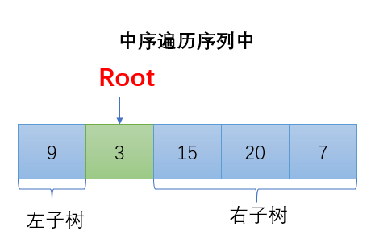
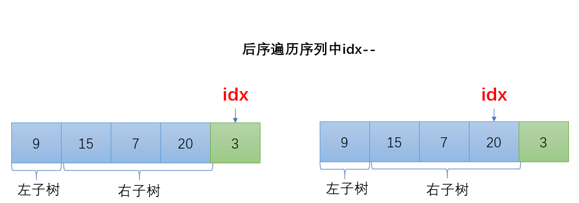
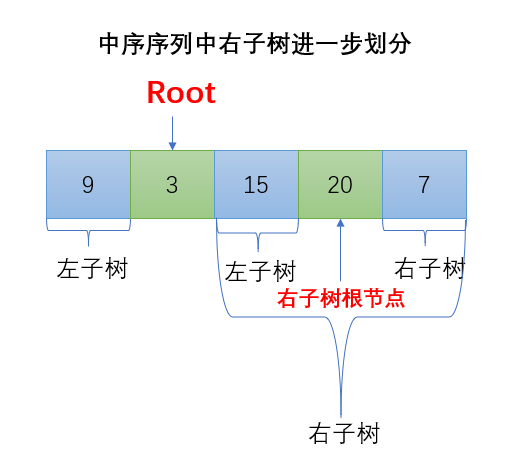

# [从中序与后序遍历序列构造二叉树](https://leetcode-cn.com/problems/construct-binary-tree-from-inorder-and-postorder-traversal)

根据一棵树的中序遍历与后序遍历构造二叉树。

注意:
你可以假设树中**没有重复的元素**。

例如，给出

`中序遍历 inorder = [9,3,15,20,7]`
`后序遍历 postorder = [9,15,7,20,3]`
返回如下的二叉树：

```
    3
   / \
  9  20
    /  \
   15   7
```


**思路：**依据中序与后序遍历序列构造二叉树是数据结构里的经典问题，类似的还有依据先序和中序遍历序列构建二叉树，思考过程类似，前者的思路为：**<font color=red>后序</font>遍历找到根节点， 中序遍历定左右的原则**，后者的思路为：**<font color=red>先序</font>遍历找到根节点，中序遍历定左右的原则**下面详细说明如何构建二叉树。

先明确中序遍历的顺序为：左子树，根节点，右子树，而后序遍历顺序为：左子树，右子树，根节点。按照示例有`inorder = [9,3,15,20,7]`，`postorder = [9,15,7,20,3]`，从后序遍历的顺序可以发现，根节点一定是最后被访问的，所以，**根节点一定在后序遍历序列的最末尾的位置**，假设使用变量`idx`指示根节点在后序序列的下标，此时`idx=4`，也就是`posterder[idx] = 3`为根节点，从后序序列中得到了根节点，我们再在中序遍历序列中找到根节点3，可以看到以3的位置将中序遍历序列分为了两部分，左边为`[9]`，右边为`[15,20,7]`，由中序遍历的顺序可以得知，**当在中序序列中确定根节点后，位于根节点左侧的所有元素都位于根节点的左子树，位于根节点右侧的所有元素都位于根节点的右子树**。



得到左右子树包含的元素后，我们可以递归进入左右子树构建左右子树。下面讨论关于递归的细节，因为我们依靠的是**后序遍历找到根节点，中序遍历定左右的原则**，当找到当前根节点后，`idx`应该改变以指向下一个根节点，这样递归构建子树的时候才可以轻松得知根节点。注意到后序遍历序列顺序为：左，右，根，如果**将`idx--`**，那么`idx`指向的位置有什么含义呢？



我们可以发现`idx`指向的位置已经进入右子树，右子树依然按照后序遍历的顺序：左、右、根，根节点最后被遍历，所以我们可以断定，此时`idx`指向了**右子树的根节点**，所以当我们递归下去的时候又可以继续按照之前的步骤，在**中序遍历序列中找到右子树根节点**，位于右子树根节点左边的为其左子树，位于右子树根节点右边的为其右子树，递归处理。



从上图中也可以发现节点20的左子树只有一个元素15，右子树也只有一个元素7，可以不比再继续递归，所以此时发现一个**递归出口为当区间被划分到只剩下一个元素时**，创建该元素，同时按照`idx`的语义执行`idx--`，然后返回即可。下面看代码实现。


代码实现的一些细节，首先我们使用下标`l`和`r`来表示我们在`inorder`的范围，在该范围内构建树。上面提到需要**查找根节点在中序遍历序列中的位置**，为了快速查找，可以使用**哈希表**存储中序遍历序列，根据后序遍历序列确定根节点的值，快速在哈希表中查找到根节点在中序遍历序列中的下标，假设根节点在中序遍历序列中的下标为`x`。则左子树为`inorder[l, x-1]`，右子树为`inorder[x+1, r]`

```cpp
class Solution {
public:
    unordered_map<int, int> hash;//哈希表存储中序遍历序列，key为节点值，val为key在inorder数组的下标。方便快速查找根节点
    TreeNode* buildTree(vector<int>& inorder, vector<int>& postorder) {
        //由后序遍历的特性得出，后序遍历序列的最后元素即为当前根节点，idx始终指向根节点
        int idx = postorder.size()-1;
        for (int i = 0; i < inorder.size(); i++) hash[inorder[i]] = i;//构建哈希表
        return build(inorder, postorder, 0, inorder.size()-1, idx);
    }

    TreeNode* build(vector<int>& inorder, vector<int>& postorder, int l, int r, int& idx) {
        if (l > r) return NULL;
        if (l == r) {	//区间内只有一个元素时，创建该元素，并返回该元素
            idx--;		//创建了一个元素后，根节点发生变化
            return new TreeNode(inorder[l]);
        }
        int root = postorder[idx--];//根节点为后序遍历序列的最后一个元素
        int x = hash[root];			//得到根节点在中序遍历序列中的位置
        TreeNode* res = new TreeNode(root);//依据根节点创建节点
        res->right = build(inorder, postorder, x + 1, r, idx);//后序序列为:左右根，因先递归创建右子树
        res->left = build(inorder, postorder, l, x - 1, idx);//递归创建左子树
        return res;
    }
};
```

