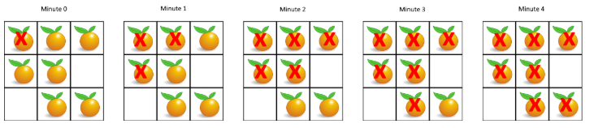

在给定的网格中，每个单元格可以有以下三个值之一：

值 0 代表空单元格；
值 1 代表新鲜橘子；
值 2 代表腐烂的橘子。
每分钟，任何与腐烂的橘子（在 4 个正方向上）相邻的新鲜橘子都会腐烂。

返回直到单元格中没有新鲜橘子为止所必须经过的最小分钟数。如果不可能，返回 -1。

 

示例 1：



`输入：[[2,1,1],[1,1,0],[0,1,1]]`
`输出：4`


示例 2：

`输入：[[2,1,1],[0,1,1],[1,0,1]]`
`输出：-1`
解释：左下角的橘子（第 2 行， 第 0 列）永远不会腐烂，因为腐烂只会发生在 4 个正向上。


示例 3：

`输入：[[0,2]]`
`输出：0`
解释：因为 0 分钟时已经没有新鲜橘子了，所以答案就是 0 。


提示：

1 <= grid.length <= 10
1 <= grid[0].length <= 10
grid[i][j] 仅为 0、1 或 2

来源：力扣（LeetCode）
链接：https://leetcode-cn.com/problems/rotting-oranges
著作权归领扣网络所有。商业转载请联系官方授权，非商业转载请注明出处。


**思路**：这题很容易看出是BFS的题，但是需要注意的是，比如起始的时候可能是有多个橘子处于腐烂状态，那么这几个橘子会再下一个时刻使得它们四周的新鲜橘子都腐烂，所以刚开始时，应该将这几个橘子都加入队列，这样来看这题就是一个**多源BFS**题。

```c++
class Solution {
public:
    int nums = 0;
    queue<pair<int, int>> q;
    int orangesRotting(vector<vector<int>>& grid) {
        int rst = -1;//所有橘子腐烂总共经历的时间，注意初始化为-1，因为此时虽然是minute0的状态，但我们没有真正让这个橘子腐烂
        for (int i = 0; i < grid.size(); ++i) {
            for (int j = 0; j < grid[i].size(); ++j) {
                if (grid[i][j] == 1) nums++;//新鲜橘子个数
                if (grid[i][j] == 2) q.push(pair<int, int>(i, j));//腐烂橘子个数
            }
        }
        if (nums == 0) return 0;//一开始就没有新鲜橘子，直接返回
        while (!q.empty()) {
            int size = q.size();
            while (size--) {//一个minute
                pair<int, int> p = q.front();
                q.pop();
                flip(grid, p.first, p.second);
            }
            rst++;//时间增加
        }
        if (nums != 0) return -1;//队列空，但是还有新鲜的橘子，此时新鲜的橘子永远不会腐烂
        else return rst;
    }

    void flip(vector<vector<int>>& grid, int i, int j) {//grid[i][j]的橘子腐烂，并且向四周传播使得其他新鲜橘子腐烂
        if (i-1 >= 0 && grid[i-1][j] == 1) {
            grid[i-1][j] = 2;
            nums--;
            q.push(pair<int, int>(i-1, j));   
        }
        if (i+1 < grid.size() && grid[i+1][j] == 1) {
            grid[i+1][j] = 2;
            nums--;
            q.push(pair<int, int>(i+1, j));
        }
        if (j-1 >= 0 && grid[i][j-1] == 1) {
            grid[i][j-1] = 2;
            nums--;
            q.push(pair<int, int>(i, j-1));
        }
        if (j+1 < grid[i].size() && grid[i][j+1] == 1) {
            grid[i][j+1] = 2;
            nums--;
            q.push(pair<int, int>(i, j+1));
        }
    }
};
```

